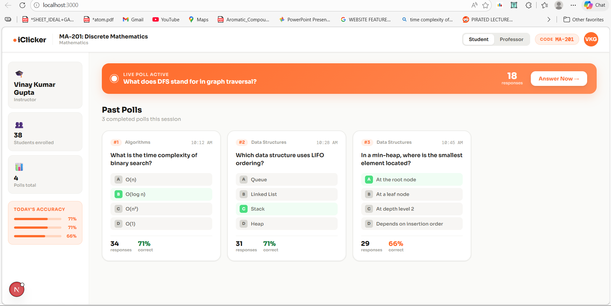

# iClicker — Course Page UI (Frontend Design)

## 📸 Preview




---

## What is this?

This is a **frontend-only UI design** for a classroom course page built with **Next.js**. It simulates what a student and professor would see inside a class session that supports live polling (iClicker-style).

The design covers two roles:

| Role | What they see |
|------|--------------|
| **Student** | Past polls (read-only), live active poll with answer submission |
| **Professor** | Past polls + results, add new poll button, close poll option, per-poll accuracy |

---

## Features 

- 🟠 **Role toggle** — Switch between Student and Professor view in the topbar
- 📊 **Past polls grid** — All completed polls shown as cards with correct answer highlighted
- 🔴 **Live poll banner** — Orange banner that appears when a poll is active
- 🖱️ **Poll detail modal** — Click any poll to see full question, options, result bars, and correct answer
- ➕ **Add poll (professor)** — Form to create a new poll with 4 options and mark the correct answer
- ✅ **Student answer flow** — Students can select and submit an answer on live polls
- 📉 **Accuracy sidebar** — Shows today's class accuracy per poll

---

## Tech Stack

- [Next.js 14](https://nextjs.org/) — App Router
- TypeScript
- CSS variables + inline styles (no Tailwind, no UI library)
- Google Fonts — [Sora](https://fonts.google.com/specimen/Sora) + [DM Mono](https://fonts.google.com/specimen/DM+Mono)

---

## Project Structure

```
iclicker/
├── app/
│   ├── globals.css          # Design tokens, CSS variables (orange/white palette)
│   ├── layout.tsx           # Root layout with font import
│   └── page.tsx             # Entry point → renders ClassroomView
│
├── components/
│   ├── data.ts              # Mock poll data + TypeScript types
│   ├── ClassroomView.tsx    # Main classroom page (topbar, sidebar, poll grid)
│   ├── PollDetailModal.tsx  # Poll detail popup (results, submission, close)
│   └── AddPollModal.tsx     # New poll creation form (professor only)
│
└── public/                  # ← Put your screenshots here
```

---