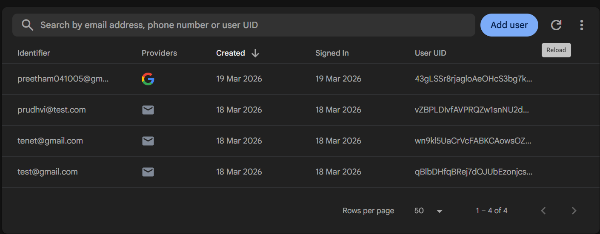
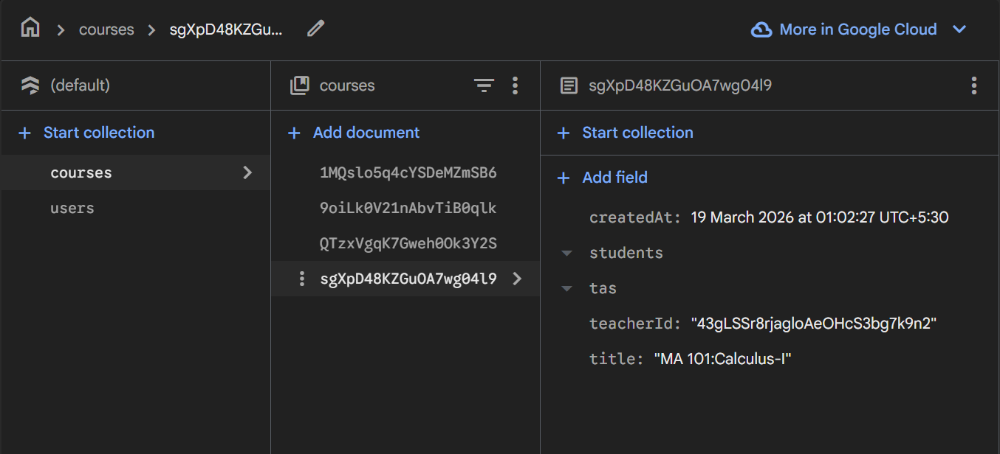
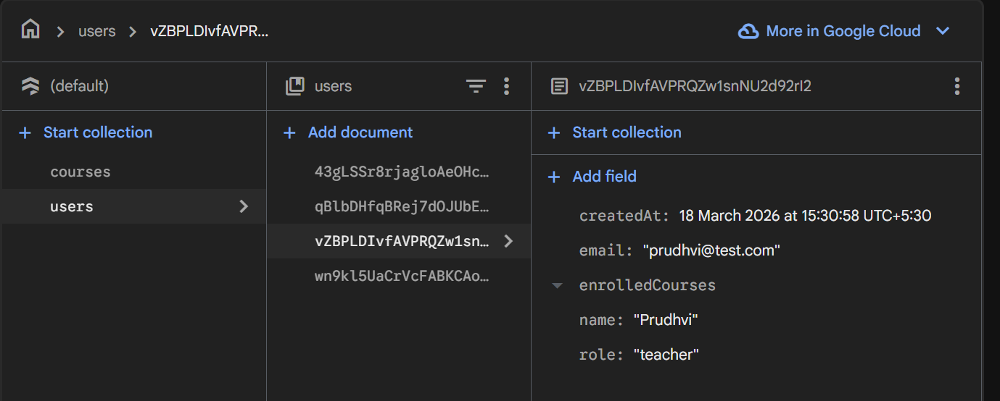

#  Firebase Authentication & Course Management

This branch contains  TypeScript modules that together handle some functions regarding **user authentication**, **course management**, and **user data retrieval** (like Google authentication, create user, create course, add/remove student, add/remove Ta) using **Firebase Authentication** and **Cloud Firestore**.

---

##  Module Overview

| File | Purpose |
|------|---------|
| `auth.ts` | Google Sign-In via redirect + Firestore user creation |
| `courses.ts` | Course CRUD operations + student/TA management |
| `users.ts` | Fetching user data from Firestore |

---

##  Code 1: `auth.ts` — Google Authentication & User Management

### Description
This module handles **Firebase Authentication** using Google OAuth via redirect flow, and manages user profile data in Firestore.

### Dependencies
```typescript
import { GoogleAuthProvider, signInWithRedirect, getRedirectResult } from "firebase/auth";
import { doc, getDoc, setDoc } from "firebase/firestore";
import { auth, db } from "./firebase";
```

## User authentication that is stored in Firebase 


---

### Functions

#### `signInWithGoogleRedirect()`
Initiates a **Google OAuth redirect flow**. The user is sent to Google's login page and returned to the app after authentication.

#### `handleRedirectResult()`
Called after the redirect returns. Checks if the authenticated user exists in Firestore:
- **Existing user** → returns `{ isNewUser: false, user, userData }`.
- **New user** → returns `{ isNewUser: true, user }` — prompts role selection.
- **No redirect result** → returns `null`.

#### `saveUserRole(uid, role, name, email)`
Called after a new user selects their role. Creates a Firestore document under `users/{uid}` with name, email, role, an empty `enrolledCourses` array, and a `createdAt` timestamp.

### Authentication Flow

```
User clicks "Sign in with Google"
        ↓
signInWithGoogleRedirect() → Redirects to Google
        ↓
User logs in → Redirected back to app
        ↓
handleRedirectResult() → Checks Firestore
        ↓
New User?  →  Ask for role  →  saveUserRole()
Existing?  →  Load dashboard directly
```

---

##  Code 2: `courses.ts` — Course Management

### Description
This module handles all **Firestore operations related to courses** — creating courses, fetching teacher-specific courses, and managing students and TAs using  array operations.

### Dependencies
```typescript
import { collection, getDocs, query, where, addDoc, doc, updateDoc, arrayUnion, arrayRemove } from "firebase/firestore";
import { db, auth } from "./firebase";
```

### Functions

#### `getTeacherCourses()`
Queries the `courses` collection with a `where("teacherId", "==", user.uid)` filter to fetch only the courses belonging to the currently logged-in teacher. Returns an array of course objects with `id` and all Firestore fields. Returns `[]` if no user is logged in.

#### `createCourse(title: string)`
Creates a new course document in Firestore under the `courses` collection. Automatically sets:
- `title` — the course name.
- `teacherId` — UID of the creating teacher.
- `students` — empty array.
- `tas` — empty array.
- `createdAt` — current timestamp.

#### `addStudent(courseId, studentId)` / `removeStudent(courseId, studentId)`
Uses Firestore's **`arrayUnion`** and **`arrayRemove`** to atomically add or remove a student UID from the `students` array of a course. `arrayUnion` prevents duplicates automatically.

#### `addTA(courseId, taId)` / `removeTA(courseId, taId)`
Same atomic pattern as student management but operates on the **`tas`** array in the course document.

## Courses collection created and used in Firebase



### Course Management Flow

```
Teacher logs in
      ↓
getTeacherCourses() → Fetch all courses by this teacher
      ↓
createCourse() → Add new course with empty students/TAs
      ↓
addStudent() / removeStudent() → Manage student enrollment
addTA() / removeTA()           → Manage TA assignments
```

---

##  Code 3: `users.ts` — User Data Fetching

### Description
This module handles **reading user data** from Firestore — either fetching all users with optional role-based filtering, or retrieving the currently logged-in user's profile.

### Dependencies
```typescript
import { collection, getDocs, query, doc, getDoc } from "firebase/firestore";
import { db } from "./firebase";
```

### Functions

#### `getAllUsers(role?: string)`
Fetches all documents from the `users` Firestore collection. Accepts an optional `role` parameter:
- If `role` is provided → filters results **client-side** to only include matching users.
- If omitted → returns all users regardless of role.

> **Note:** Filtering happens in memory after fetching all documents — not as a Firestore query filter. For large datasets, a server-side `where` filter is more efficient.

Each returned user object contains: `uid`, `name`, `email`, and `role`.

#### `getUserData()`
Uses a **dynamic import** (`await import("./firebase")`) to load the `auth` instance — this pattern avoids potential circular dependency issues at module load time. Checks `auth.currentUser`, fetches the corresponding Firestore document from `users/{uid}`, and returns the data or `null` if not found or not logged in.

## User collection created and used in Firebase


### User Fetching Flow

```
getAllUsers()          → Fetch all users → optionally filter by role
      ↓
Used by teachers/admins to list students or TAs

getUserData()         → Get current user's UID from Auth
      ↓
Fetch users/{uid} from Firestore
      ↓
Return profile data or null
```

---


##  Prerequisites

- [Firebase](https://firebase.google.com/) project with **Authentication** and **Firestore** enabled.
- A `firebase.ts` file exporting configured `auth` and `db` instances.
- Google Sign-In enabled in Firebase Authentication console.

---
As this branch has no frontend as of now, these functions are integrated, when the frontend of these corresponding modules are done.